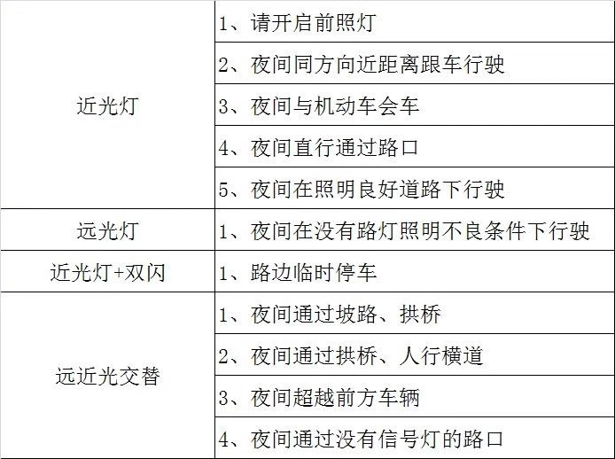

# 科目三

**详细讲解科目三的相关知识**

-----

## 概述
科目三考试分为道路驾驶技能和安全文明驾驶常识两部分
各部分考试内容如下

* **道路驾驶技能考试**
  1. 上车准备、起步、直线行驶
  2. 变更车道
  3. 靠边停车
  4. 直行通过路口
  5. 路口左右转弯
  6. 通过人行横道线,学校区域，公共汽车站
  7. 会车,超车,掉头夜间行驶
  > 其他考试内容由省级公安机关交通管理部门确定
* **安全文明驾驶常识**
  1. 安全文明驾驶操作要求
  2. 恶劣气象和复杂道路条件下的安全驾驶知识
  3. 爆胎等紧急情况下的临危处置方法以及发生交通事故后的处置知识等。

科目三道路驾驶技能和安全文明驾驶常识考试满分分别为100分，成绩分别达到90分的为合格。

## 灯光控制
**灯光以旧版雪铁龙为例**

### 基本控制
1. **液晶时间显示** 左边摇把外层旋钮向上旋转一次
2. **近光灯** 左边摇把外层旋钮向上转动两次
3. **远光灯** 左边摇把向上拨动一次
4. **左转灯** 左边摇把下拨
5. **右转灯** 左边摇把上拨
6. **双闪灯** 车身红色按钮

### 各种条件下控制
参看下图 

重点如下:

1. 听到通过和超越需要闪烁远光灯,分为如下两种情况
   1. 若未开远光则扒两下
   2. 若开了远光则需先将远光关闭,在扒两下,总共三下
2. **夜间直行通过路口** 近光灯即可,若开了远光则关闭
3. 听到指令后进行操作,眼睛盯着仪表盘,5 s 内完成动作

**注意事项:**

1. 一定要等语音播报结束后在打灯,不要抢打
2. 灯光结束后一定要确认回位,特别是在转向等过程中,避免由于长时间未
回位导致错误。
3. 灯光播报时看着仪表盘,避免错误

## 换档
以雪铁龙旧版车型为例。各档位关系如下
初始状态为空挡。

1. **一档** 左上到一档
2. **二挡** 左下到二挡
3. **三挡** 上推到三挡
4. **四挡** 下推到四挡
5. **五档** 右上
6. **倒挡** 右下
   

注意一些典型的档位切换
1. **一档到二挡** 把挡把往左拉直接下拉即可
2. **二挡到三档** 向上推动回到空挡,再向上到达三挡
3. **三挡变四挡** 直接下拉两下
4. **四挡变三挡** 上推两下

> 注意所有档位变化踩紧离合,下面对各档位常见的
> 换挡条件进行说明

详见 [离合换挡](http://www.yescar.cn/news/281/200701/41192.shtml)

### 一档
一档的常见使用场景如下
1. 起步阶段
2. 低速转弯掉头阶段

换挡详细流程如下
1. 踩紧离合
2. 从空挡左上进入一档
3. 缓慢抬起离合使车起步行驶

### 二挡
二挡用于车辆掉头。流程如下
1. 踩紧离合
2. 左下切换到二挡
3. 若车速起来后可以直接松掉离合

三挡等同上

### 典型问题
1. 换挡时不要踩油门
2. 换挡时不要动作过大导致换挡失败
3. 当车速起来后,可以快速抬起离合,无需慢抬,加减档均是如此

## 变道
1. 打转向灯
2. 观察后视镜看是否安全
3. 确认安全后,方向盘根据变道方向打 90 度驶入对应车道
4. 微调方向盘回正后继续行驶

> **注意打完转向灯不要立即变道,必须等待 3s 及以上时间后确认安全在变道**

## 超车
1. 打左转向灯
2. 观察左后视镜,确认安全后 **等待时间大于等于 3s**
3. 方向盘左打 90 度驶入左边车道
4. 驶入车道后,方向盘右打 90 度回正方向
5. 打右转向灯
6. 观察右后视镜,确认安全后,**等待时间大于等于 3s**
7. 方向盘右打 90 度驶入右边车道
8. 驶入车道后,反向盘左打 90 度回正方向
9. 继续行驶

## 加减速
1. 一档轻踩油门提速到 10km/h 挂 2 档
2. 轻踩油门提速到 20km/h 挂 3 挡
3. 轻踩油门提速到 30km/h 挂 4 挡
4. 加速到 40km/h 保持 3s
5. 轻踩刹,减速到 30km/h 挂 3 挡
6. 轻踩刹,减速到 20km/h 挂 2 挡

> 一般保持 3 挡,以 25km/h 速度行驶即可
即使不踩油门也可维持到 20km/h 

## 路口转弯
### 路口右转
1. 在驶入对应路口前确认在最外侧车道方便右转
2. 提前打右转向灯
3. 在靠近右转箭头时,踩刹减速
4. 转弯过程中不要压线驶入最外侧车道

### 路口左转
1. 在进入路口前驶入最内侧车道方便左转
2. 提前打左转向灯
3. 看到左转箭头,踩刹减速
4. 驶入路口中间后再转向
5. 转入最内侧车道

> 注意在路口转弯时若遇到对向来车或抢道,一定要在路口外停车,挂一档后重新起步
> 避免路口内停车直接挂

## 掉头
1. 提前打左转向灯,观察左后视镜确认安全,**等待时间大于等于 3s**
2. 踩刹,减速到 20km/h 时挂 2 档
	> 若无法转弯,停车,条件符合后挂一档转弯
3. 方向盘打死转弯
4. 回正后,重新挂到 3 档

## 靠边停车
1. 打右转向灯
2. 观察右后视镜确认安全后,**等待时间大于等于 3s**
3. 变道减速,挂到 2 档,注意速度降到 20 就可以变档了
4. 观察车身距离左边白线距离 30cm
5. 缓慢减速停车
6. 挂空挡,拉手刹
7. 检查仪表盘灯是否回位
8. 熄火
9. 身体左转,确认安全后,右手打开车门,左手关门,**切记不要下车**
10. 等待考试员执行开车门关车门动作。
11. 报成绩合格后,解安全带下车

## 科目三考试流程
前川考场,科目三有三个考区,每个考区在行驶过程中会有路线差异,
各考区信息如下:

* **一号线**
  * 有红绿灯
  * 启动后靠内侧车道行驶,变道超车后,保持车道不变,右转弯时,靠外侧车道转弯,然后调头一直靠内侧车道行驶

* **三号线**
  * 有红绿灯
  * 启动后靠内侧车道行驶,变道超车后会变到外侧车道,**报直行结束后变到内侧车道**右转弯,靠外侧车道加速后变到内侧车道掉头,掉头后外侧车道行驶,再变到内侧车道行驶

* **五号线**
  * 无红绿灯
  * 靠内侧车道行驶,变道超车后会到外侧车道,右转弯后到中间车道加速,加速后变到内侧车道,掉头到外侧车道,然后变到内侧车道行驶

 
科三考试基本流程如下

1. 上车,录入指纹,**等待电脑报考试考试后执行第二步**
2. 下车,从左后方绕车声依次按四个按钮,每个按钮都会有对应提示音,若无提示音则重新按
   > 由于电脑在前排右侧,为了避免听不到语音,**在按按钮时,注意仔细听电脑声音**
3. 按完后,回到车上,系安全带,调整座椅,试踩离合刹车感受行程
4. 等待语音播报点火后,再点火
   > 注意已经点火则也需要扭动点火装置
5. **听到灯光考试后**,模拟夜间灯光考试。
   > 一定注意等语音播报结束会再打灯和关闭灯光
6. **报起步后**,打左转向灯,起步
7. 观察左方后视镜确认安全后,向左打 90 度变换车道
8. 车道驶入后加速到三档平稳行驶。
	> 保持 25km/h 速度
9.  考试员点会车,语音播报后,方向盘轻微右打回正即可
10. 考试员点变道,语音播报后,变道
11. 考试员点超车,语音播报后,超车
12. **注意通过所有人行道,汽车站,拐弯点时均需要踩刹!!！**
13. 路口右转记得打灯踩刹
14. 拐弯后加减速行驶
	> 加速需要保持车速到 35km/h,建议加到 40
15. 然后掉头
16. 路口左转
17. 靠边停车
18. 观察车灯是否关闭没有则关闭车灯
19. 停车熄火
20. 侧身确认安全后,右手打开车门
21. 等待考官打开车门关闭车门
22. 等待考官操作,电脑报成绩
23. 成绩合格后感谢考官,解安全带下车
